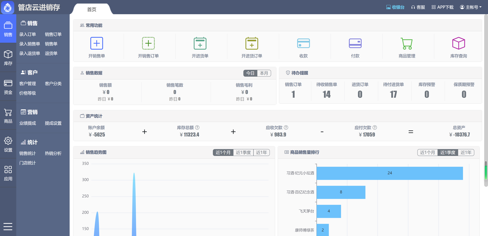
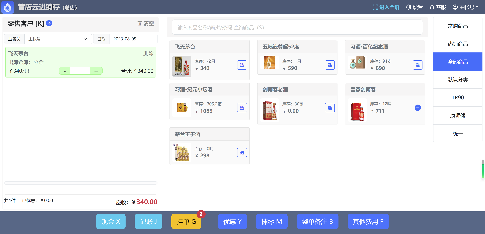
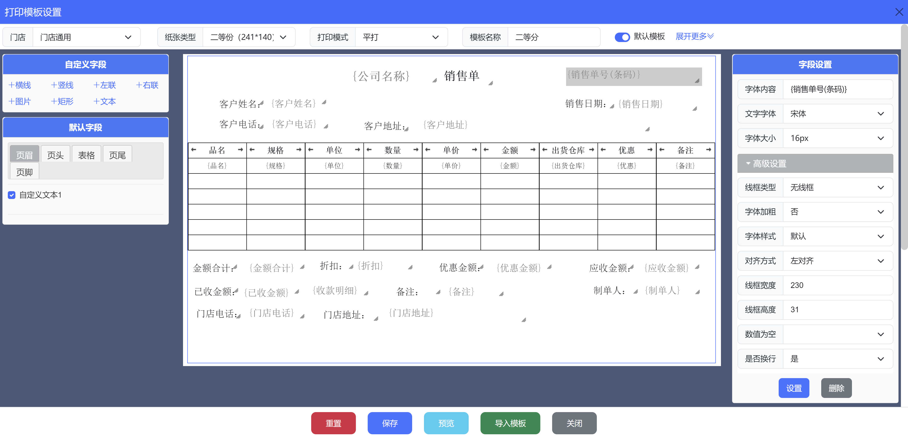
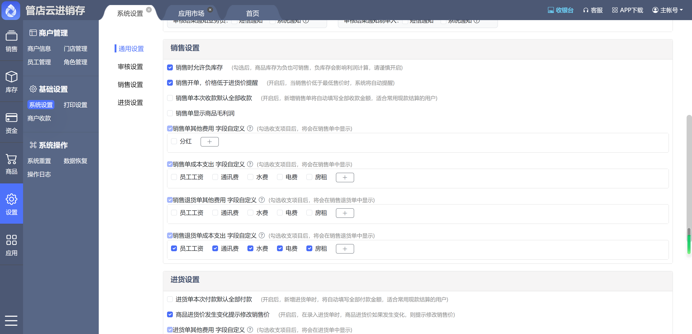
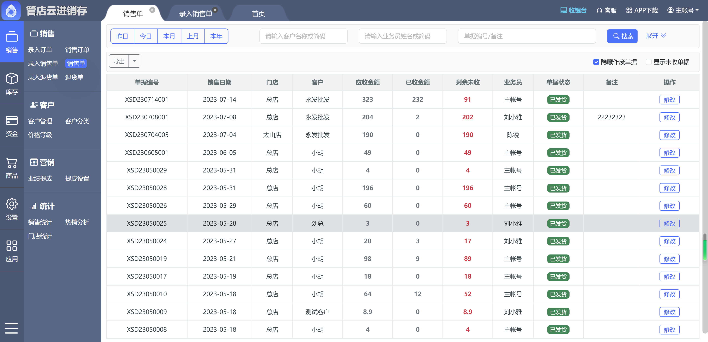
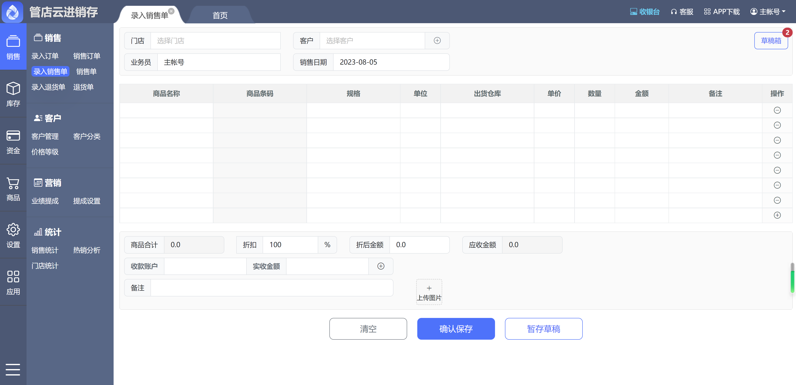

<p></p>
<p></p>


<div align="center">

[官方网站](https://www.guanxdian.com/) | [在线演示](https://guanxdian.cn/demo)

</div>

<p></p>
<p></p>
<p></p>
<p></p>

---

**<p align="center">【📣最近通知】还有什么想要产品/技术上友好的建议或意见，请跟我们联系，将纳入开源贡献者并官网致谢，还会收到社区奖励的小礼品哦！~</p>**

**<p align="center">管店云 V2.0 正式发布啦，更多能力逐步升级，欢迎大家提前体验！<a href="https://guanxdian.cn/demo" target="_blank">点击立即体验~</a></p>**


**<p align="center">如果您觉得我们的开源项目很有帮助，请点击 :star: Star 支持 管店云 开源团队:heart:</p>**

---

# 版权声明

开源不代表免费，管店云 遵循 [GPL-3.0](https://gitee.com/o88o/psi/blob/master/LICENSE) 开源协议发布，并提供技术交流学习，但**绝不允许修改后和衍生的代码做为闭源的商业软件发布和销售！** 如果需要将本产品在本地进行任何附带商业化性质行为使用，**请联系项目负责人进行商业授权**，以遵守 GPL 协议保证您的正常使用。

帮助手册——管店云 需要付费吗？
*   **社区版** ：我们承诺之前、现在以及未来所有开源的源码免费供个人用户学习，不收取任何费用；需要注意的是，在学习或使用过程中需要遵守开源协议。
*   **商业版** ：若企业想自用或商用，必须选择商业授权版本，我们也酌情接受根据个人/企业客户需求，进行系统的定制化开发；


管店云 开源团队拥有对本开源协议的最终解释权。

# 一、 关于 管店云

## 1.1 介绍

> 管店云, 技术链接产业.

管店云为传统实体产业提供进销存管理解决方案，实现进货、库存、销售、收银、记账完整的业务场景，帮助传统产业实现数字化转型，提升管理效率，提高自身数字化经营的能力，让管人管账管货更轻松。

主要运用于零售门店、商贸批发、生产工厂等行业领域。
各行各业可在管店云基础上定制开发自有特色需求。

## 1.2 能力


管店云 v2.0社区版 将逐步开源啦：
整个系统共分为十一大模块：

*   **销售管理** ：包括销售单、退货单管理、客户管理、价格等级管理等功能；
*   **进货管理** ：包括进货单、进货退货单、进货统计等功能；
*   **库存管理** ：包括库存查询、库存盘点、库存流水等功能；
*   **资金财务管理** ：包括客户收款对账、供应商付款对账、日常收支、结算账户互转、资金流水、经营利润统计等功能；
*   **商品管理** ：包括商品分类、规格管理、单位管理、属性管理、商品管理等功能；
*   **系统设置** ：包括员工管理、角色管理、系统设置、打印设置、操作日志等功能；


我们欢迎感兴趣的贡献者积极参与 管店云 新版的开源中，如有兴趣通过下方的联系方式联系我们哦~

## 1.3 优势

管店云 提供主流进销存业务流程，具备进销存最核心的功能，主要优势有：

* 采用主流 Java 架构，具备高拓展性、灵活性，避免 PHP 架构的缺点；
* 代码简洁，低成本二次开发，有更多时间陪老婆孩子或女友；
* 产品用户体验好，可以快速学习适用。


## 1.4 愿景

管店云 不做技术宅，而是通过技术让每个传统企业能够有更好用的软件产品，有落地的解决方案，一个好软件，不是功能多，而且真正能够帮助传统企业能够降本增效。


# 二、关于项目

## 2.1 在线体验

开源演示地址：[https://guanxdian.cn/demo](https://guanxdian.cn/demo)

默认账号密码：15888888888，667788

_（注意：演示环境已屏蔽管理权限和相关操作）_

## 2.2 技术栈

* 前端技术栈：bootstrap、jquery、echarts、layer；
* 后端技术栈：jfinal、redis；

## 2.3 项目结构

**项目结构**

```
├── psi-common             // 公共组件模块
├── psi-fund	      // 资金财务模块
├── psi-purchase	      // 进货、库存模块
├── psi-sale            // 销售相关模块
├── psi-trader	      // 关键业务模块
├── psi-web            // PC端业务模块

```

## 2.4 项目部署

项目部署方式：


建议服务器最低配置：

| 类型 | 配置 |
|:-:|:-:|
|操作系统|CentOS7以上|
|CPU|2核|
|内存|4G|
|带宽|1M|
|硬盘|100G|

## 2.5 产品截图








# 三、常见问题

完善中...


# 四、最近更新

## V2.0 更新日志

- [x] ；
- [x] ；
- [x] ；


# 五、联系我们

如果你想跟我们的交流开源，你有任何 管店云 产品上的想法、意见或建议，或商务上的合作需求，请扫码添加 管店云 项目团队沟通：


# 六、捐赠支持

## 7.1 来一壶枸杞茶

如果您觉得我们的开源项目 `管店云` 对您有帮助，那就请项目开发者们来一壶枸杞茶吧！当前我们接受来自于**微信**、**支付宝**或者**码云**的捐赠，请在捐赠时备注自己的昵称或附言。

您的捐赠将用于支付该项目的一些费用支出，并激励开发者们以便更好的推动项目的发展，同时欢迎捐赠**公网服务器**用于提高在线演示系统体验。


## 7.2 长期捐赠

如果您是企业的经营者并且有计划将 `管店云` 用在公司的经营产品中，欢迎进行长期捐赠。长期捐赠有商业上的益处有：

* 积极响应，快速维护，及时更新；
* 企业名称、Logo 及官网链接将长期展示在开源仓库、`管店云` 官网及宣发材料中；
* 捐赠金额同比例抵扣未来 `管店云` 的付费产品价格。

如果您对长期赞助 `管店云` 团队感兴趣，或者有其他好想法，欢迎联系开发团队微信 `guanxdian`，或发送邮件到 275477265@qq.com。

---

**<p align="center">如果您觉得我们的开源项目很有帮助，请点击 :star: Star 支持 管店云 开源团队:heart:</p>**

---